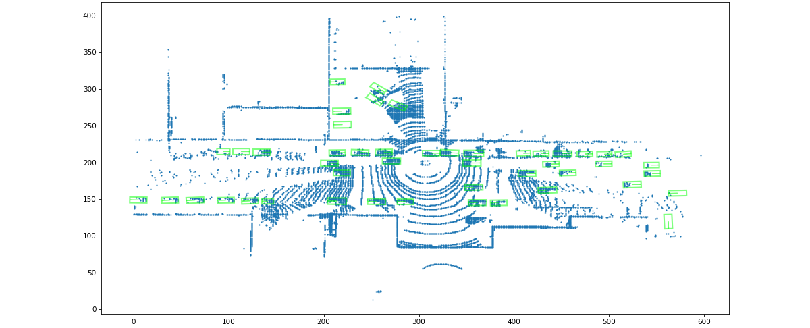
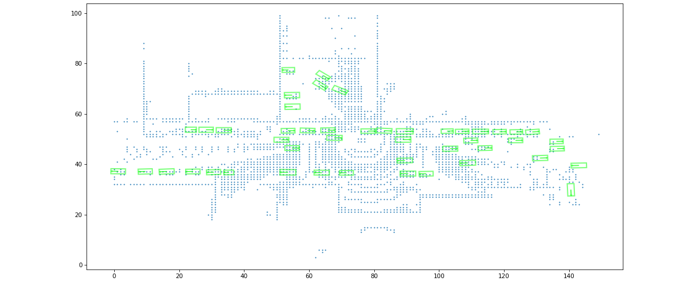
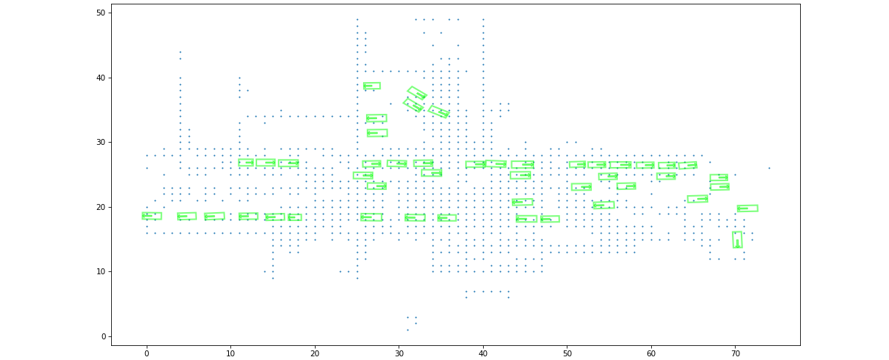

# CSC490 Module 1 - Part A

### Qiwen Hua and Ben Weisz

## 2.1 LiDAR Voxelization

**Part 2:** 

In the implementation of the `Voxelizer.forward` function, we map raw LiDAR points to voxels by taking the difference between the points and bounds (e.g. `x_max`) and scale down by `step`. Therefore, larger `step` yields lower resolution for the voxelized point clouds, thus decreases the amount of captured information. 

We can visualize the conclusion above by plotting the voxelized LiDAR point clouds for scene `000` with four different `step`s $\in \{0.25, 0.50, 1.00, 2.00\}$. The plots are shown below (top-left `step = 0.25`, top-right `step = 0.50`, bottom-left `step = 1.00`, bottom-right `step = 2.00`):

    
    

    
    

From the plots above, we can see that the image with the highest resolution (top-left) captures much more information than the image with the lowest resolution (bottom-right). However, in order to have high fidelity of the voxel grid, the grid size also needs to be larger. Namely, the top-left image has a size of 600 by 400 while the bottom-right image has a size of 75 by 50; the size of the former grid is 64 times larger than the latter. 

Therefore, we can conclude that the fidelity of the voxel grid comes at the cost of larger memory consumption (to store the larger grid). In addition, performance is also sacrificed as more captured information (voxel points) leads to more intensive computations. 

Things I need to do:
- Set the log frequency to 10 and graph the loss to determine a good stopping iteration
- Improve the loss function with notes from research paper
- Answer part 1 questions
- Part 2.1.2 run voxelizer.forward on different scales
- Finish analysis of voxelizer scales
- Possibly create overlay of paint cloud on heatmap and optimize scale for heatmap
- Finish 2.2.5 by overfitting the data ad provide some diagrams
- Finish 2.2.6 - traing the model and peform the test providing some outputs
- Finish 2.3.3 - Plot the pr curve and answer those questions
- Answer questions in 2.3.4